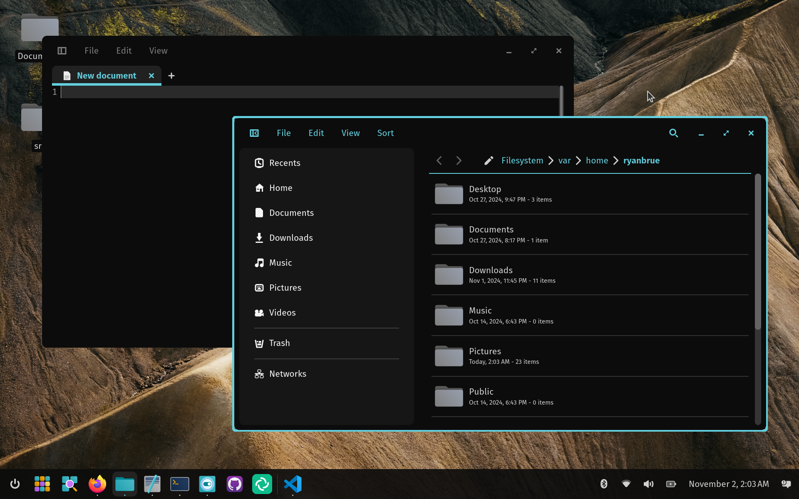

# ryanabx's COSMIC configuration

Generated on November 2, 2024. Dotfiles may be out-of-date depending on what has changed since then.

## Usage

```shell
git clone https://github.com/ryanabx/cosmic-dotfiles.git

# Load the panel template

cargo install --git https://github.com/ryanabx/cosmic-ext-config-templates
cosmic-ext-config-templates load-file cosmic-dotfiles/panel-template.ron

# To load the color-theme.ron file, go to cosmic-settings > desktop > appearance, then import
```

## Screenshot (Nothing fancy)

